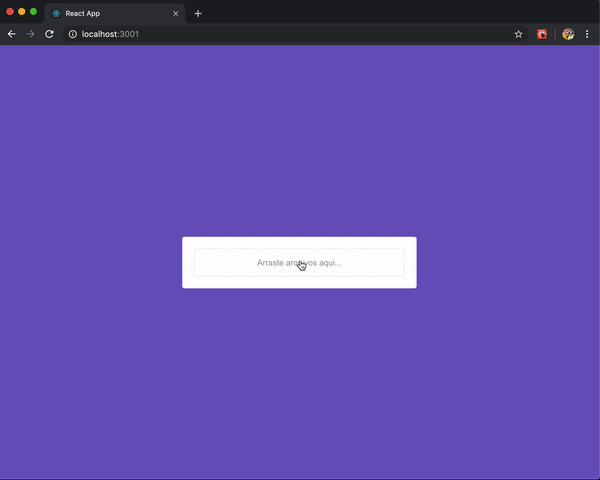

# Instalação

- Instale as dependencias com **npm install** ou **yarn**

- Utilize o backend usado feito em Node Js que está disponível aqui -> <a href="https://github.com/marlonauthority/nodejs-upload-images-amazonaws">Node Js</a>

